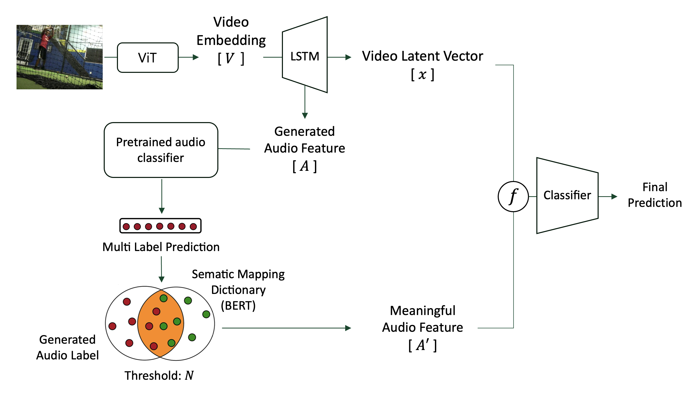
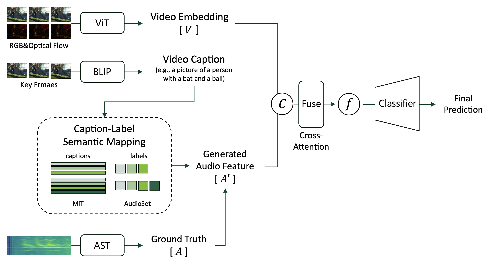

# Team-Info
| (1) 과제명 | Generating Missing Auditory Modality via Semantic Mapping for Video Action Recognition
|:---  |---  |
| (2) 팀 번호 / 팀 이름 | 21-가능한 |
| (3) 팀 구성원 | **김지은** (2140010): 리더, *기본 데이터 전처리, caption-based dictionary 활용 아키텍처 설계 및 구현, transformer 활용 오디오 특징 추출*   **윤서아** (2168019): 팀원, *TSN 기반 feature extraction, BERT 활용 semantic mapping dictionary 설계*   **장은성** (2271052) : 팀원, *transformer 기반 프레임워크 중 video 전처리, feature 추출 부분 설계 및 구현*            |
| (4) 팀 지도교수 | 이형준 교수님 |
| (5) 과제 분류 | 연구 과제 |
| (6) 과제 키워드 | Generative AI, Video Action Recognition, Multimodal, Semantic Mapping  |
| (7) 과제 내용 요약 | 본 연구는 비디오 시퀀스를 기반으로 오디오 피처를 재구성하여, 결손된 오디오 데이터를 보완하고 이를 통해 모델의 정확도를 향상시키는 것을 목표로 한다. 이를 위해 비디오와 오디오 간의 의미적 정렬을 수행하는 개념인 Semantic Mapping을 차용하였다. 두 가지 아키텍처를 제안하는데, 공통적으로 비디오로부터 오디오 피처를 생성하지만, 검증 및 활용 방식에서 차이를 보인다. 첫 번째 아키텍처는 CNN과 LSTM을 활용하여 오디오 피처를 생성한 후, Semantic Dictionary를 이용해 의미적 유효성을 검증한다. 이 검증을 통과한 피처만 학습에 활용하는 방식이다. 두 번째 아키텍처는 Transformer를 활용해 대표 프레임을 추출하고, 캡션으로 변환한 뒤 이를 키로 사용하는 Semantic Dictionary을 만든다. 이 사전을 참조하여 오디오 피쳐를 생성해낸다. 두 아키텍처를 비교 분석함으로써, 의미 기반 피처 정렬 방식이 오디오 생성 및 영상 이해 성능에 미치는 영향을 규명하고자 한다. |

 

# Project-Summary
| 항목 | 내용 |
|:---  |---  |
| (1) 문제 정의 | 비디오 기반 행동 인식에서는 멀티모달(시각+청각) 정보를 활용한 학습이 정밀도를 높이는 데 필수적이다. 하지만 현실에서는 오디오가 손실되거나, 특정 모달리티만 라벨링된 데이터셋이 많아 멀티모달 학습의 효과가 제한된다. 특히 오디오 모달리티는 파일 손상, 녹음 품질 저하, 무관한 배경음 등으로 인해 활용이 어려운 경우가 많다. Target Customer는 멀티모달 행동 인식 시스템을 개발하려는 연구자, 기업, 산업계로, 오디오 결손 상황에서 학습 정확도를 유지할 수 있는 보완적 해결책이 필요하다. |
| (2) 기존연구와의 비교 | 기존 연구는 문제 해결을 위해 비디오의 시공간적 특징을 매핑해 오디오 피처를 재구성하는데, 이는 비디오 시퀀스와 의미적 정합성을 고려하지 못한다는 한계를 가진다. 또한, 비디오-오디오 의미적 매핑 사전을 구성해 비디오와 무관한 데이터를 드롭아웃하는 기법을 적용한 기존 연구는 여전히 오디오가 결손된 상황에 대한 극복이 어렵다. 본 과제는 이들 연구와 달리, 비디오-오디오 간의 **의미적 정합성(semantic consistency)**을 고려하여 오디오 피처를 생성하고, 정합성 검증을 통해 학습에 사용함으로써 더 높은 신뢰성과 정확도를 보장한다는 점에서 차별화된다. |
| (3) 제안 내용 | 본 프로젝트는 결손된 오디오 피처를 보완하고 행동 인식의 정확도를 향상시키기 위한 두 가지 아키텍처를 제안한다.     **① Semantic Validation Architecture**: Transformer 기반으로 비디오에서 피처를 추출한 후, 생성된 오디오 피처에 대해 액션 라벨 예측을 수행하고, 시맨틱 사전을 이용하여 정합성을 검증한 뒤, 정합성이 확인된 피처만 학습에 사용.    **② Caption-based Attention Mapping Architecture**: Transformer 기반으로 대표 RGB 프레임에서 자연어 캡션을 생성하고, 이를 시맨틱 사전의 키로 활용하여 비디오와 오디오 라벨 간의 의미 매핑을 attention 기반으로 정교화하여 정합성을 강화. |
| (4) 기대효과 및 의의 | - 오디오 결손 상황에서도 높은 정확도를 유지하는 행동 인식 모델 구현 가능  - 의미 기반 피처 생성 및 검증을 통해 멀티모달 학습의 신뢰성 제고  - 행동 인식 분야를 넘어 결손 오디오 복원, 의료 영상 등 다양한 멀티모달 응용 분야로 확장 가능  - AGI(Artificial General Intelligence)를 위한 인간 유사 인지 능력 구현에 기여 |
| (5) 주요 기능 리스트 | **[공통 모듈]**   - 비디오 데이터 전처리 모듈  - 비디오 특징 추출 모듈 - 오디오 데이터 전처리 모듈 - 오디오 특징 추출 모듈 - Audio Feature Generator - Action Recognition Classifier   **[첫번째 아키텍처 모듈]**   - Multi Label Predictor  - Semantic Dictionary  - Feature Filter   **[두번째 아키텍처 모듈]**   - Representative Frame Extractor   - BLIP-based Caption Generator   - Semantic Mapping | |

 
 
# Project-Design & Implementation
| 항목 | 내용 |
|:---  |---  |
| (1) 요구사항 정의 | **[기능별 상세 요구사항]**   - 비디오의 시각적 정보와 시퀀스 정보로부터 오디오 피처를 생성한다.   - 생성된 오디오 피처의 의미적 정합성을 검증한다   - 또는, 피처 자체에 정합성 부여를 위해 딕셔너리를 활용한다   - 의미 정합성이 부여된 오디오 피처만 비디오 피처와 fuse하여 모델 학습에 사용한다.   - 두 아키텍처의 성능을 비교/분석해 최적화한다.     **[설계 모델]**   - **공통 모듈**: 비디오 데이터 전처리 모듈, 비디오 특징 추출 모듈, 오디오 데이터 전처리 모듈, 오디오 특징 추출 모듈, Audio Feature Generator, Action Recognition Classifier   - **첫번째 아키텍처**: Multi Label Predictor, Semantic Dictionary, Feature Filter   - **두번째 아키텍처**: Representative Frame Extractor, BLIP-based Caption Generator, Semantic Mapping   - 위와 같이 모듈을 크게 3개로 나누어 설계했으며, 두 아키텍처는 공통 모듈을 공유한다. 아키텍처에 따라 세부 구조는 상이하다.     **[데이터 셋]**   - 비디오: Moments in Time(MiT)   - 오디오: AudioSet |
| (2) 전체 시스템 구성 | **[데이터 전처리]**   MiT(Moments in Time) 데이터셋 사용 (각 비디오는 3초, 비디오에 따라 오차 있으며, RGB 비디오, action calss는 304개).  각 비디오를 선행논문에 따라 6fps의 RGB frames로 추출했다.    6fps로 추출 시 비디오 당  15frames에서 24frames 정도로 오차가 발생, 그 중 18 frames인 비디오가 가장 개수가 많다.   → 따라서 초기 모델 설계 시 안정성을 위해 가장 개수가 많은 18frames 비디오로 학습 및 튜닝 진행하기로 결정했다.   또한 클래스 당 비디오가 1000개~4000개로, 데이터의 크기가 매우 크다.   → 전체 클래스 304개 중 랜덤한 20개로만 실험을 진행하기로 결정했다.     **[첫번째 아키텍처]**      - 이미지와 오디오 피처는 transformer를 사용해 임베딩으로 처리한다.   - LSTM을 기반으로 오디오 피처를 생성한다.   - 생성한 오디오 피처를 사전 학습된 AST classifier를 사용해 multi label prediction 한다.   - 예측된 라벨과 Semantic Dictionary의 유사도 비교를 통해 의미 반영 정도를 계산한다.   - Threshold N을 지정해 N을 넘은 유사도를 가진 피처만을 '유의미한 피처'로 필터링해 학습에 활용한다. (이 때, N은 최적화 되어야 한다.)   - 이 때, Semantic Dictionary는 MiT의 action 라벨과 AudioSet의 오디오 라벨 간의 의미적 관계를 BERT로 매핑한 사전이다.   - 필터링된 오디오 피처와 비디오 피처를 fuse하여 최종 classification에 사용한다.     **[두번째 아키텍처]**      - 이미지와 오디오 피처는 transformer를 사용해 임베딩으로 처리한다.   - 프레임 간 object의 이동량을 기준으로 영상 당 n개의 대표 이미지를 계산한다.   - n개의 대표 이미지에 대해 BLIP 모델을 사용해 캡션을 생성한다.   - N개의 캡션과 유사한 키 캡션을 Semantic Mapping 한다.   - 키 캡션에 매핑된 오디오 라벨 임베딩을 참조한다.   - 이 때, 캡션을 생성하는 BLIP과 Semantic Mapping을 위한 BERT는 학습 과정에서 fine-tuning 된다.   - LSTM에 랜덤노이즈 + 라벨을 매개로 참조하는 오디오 피처 + 대표 프레임의 시각 피처를 입력으로 하여 오디오 피처를 생성한다.   - 원본 비디오의 오디오 피처를 ground truth로 하여 생성 네트워크를 학습시킨다.   - 생성된 오디오 피처와 비디오 피처를 fuse하여 최종 classification에 사용한다. |
| (3) 주요엔진 및 기능 설계 | **[ 공통 모듈 ]**   **RGB Frames Extractor**: 이 모듈은 모델 학습을 위한 비디오 전처리 도구로, cv2, os, csv, shutil, ThreadPoolExecutor 등의 라이브러리를 활용하여 원본 비디오에서 6fps 간격으로 RGB 프레임을 추출하고, 18프레임을 정확히 가진 비디오만 필터링하여 저장한다. 추출된 프레임은 프레임 개수를 분기로 18frames 또는 others 폴더에 저장되며, 처리 여부는 CSV로 기록되어 중복을 방지한다. 전체 클래스별 비디오를 병렬 처리하여 속도를 높였다.     **Optical Flow Frames Extractor**: 이 모듈은 RGB 프레임 간의 움직임 정보를 시각화하기 위해 Optical Flow 이미지를 생성하는 전처리 도구다. cv2, os, numpy, ProcessPoolExecutor, ThreadPoolExecutor 등의 라이브러리를 활용해 프레임 간의 흐름을 Farneback 알고리즘으로 계산하고, 이를 HSV → BGR 포맷의 컬러 이미지로 변환하여 저장한다. 비디오당 총 18개의 Optical Flow 이미지를 생성하며, 첫 프레임은 복제하여 정확히 18개로 맞춘다. 클래스별 학습/검증 비디오를 병렬로 처리하여 효율성을 높이고, 이미 처리된 비디오는 건너뛰도록 설계되었다.     **Audio Extractor**: 이 모듈은 RGB 프레임 수가 18개로 필터링된 비디오에 대해서만 오디오를 추출하고, 그 중 무음이 아닌 오디오만 선별하여 학습에 사용할 수 있도록 한다. subprocess, wave, numpy, ThreadPoolExecutor 등의 라이브러리를 활용해 먼저 모든 비디오에서 .wav 형식의 오디오를 추출하며, ffmpeg를 통해 16kHz, mono, 16bit PCM 설정으로 변환한다. 이후 wave 모듈과 RMS 계산을 통해 사운드의 데시벨 기준으로 무음 여부를 판단하고, 무음으로 판단된 오디오는 자동으로 삭제되며, 해당 비디오 ID는 별도의 CSV에 기록되어 중복 처리를 방지한다. 전체 처리 과정은 병렬로 수행된다.   이렇게 추출된 .wav파일을 AST 모델을 사용해 특징 추출하였다. 먼저 오디오를 spectrogram으로 변환한 후, 이를 패치로 나누고 positional embedding 및 [CLS] 토큰을 맨 앞에 붙여 transformer의 인풋으로 사용하였다. 주로 피처는 [CLS] 토큰의 output을 사용하지만, 본 연구에서는 오디오 및 비디오를 시퀀스로 처리하는 것이 핵심이기 때문에, [CLS] 토큰이 아닌 그 뒤에 붙는 patch sequence의 transformer output을 피처로 사용하였다.     **ViT-Based Video Feature Extractor**: 이 모듈은 RGB 및 Optical Flow 이미지 프레임으로부터 ViT (Vision Transformer) 기반 구조를 활용해 비디오 피처를 추출한다. 각 프레임은 spatial patch 단위로 임베딩되며, 시간 정보를 포함한 spatiotemporal token으로 확장된다. 이후 Hugging Face의 ViT 모델을 활용하여, Transformer 인코더를 통해 비디오 피처를 추출한다. ViT 내부의 patch embedding 레이어는 별도의 전처리 과정을 거친 입력을 그대로 활용하기 때문에 nn.Identity()로 대체하였다. 또한, 일반적인 ViT가 [CLS] 토큰만을 출력으로 사용하는 것과 달리, 본 구조에서는 각 patch sequence의 Transformer 출력을 활용하여 최종적으로 [18, 768] 형태의 시퀀스 기반 비디오 피처를 추출한다. 이러한 과정을 RGB 및 Flow 모달리티 각각에 대해 수행하며, 결과는 클래스명과 비디오 ID를 키로 하는 딕셔너리 형태로 구성하여 .npy 파일로 저장한다.     **AST-Based Audio Feature Extractor**: 이 모듈은 추출된 .wav 오디오 파일로부터 AST (Audio Spectrogram Transformer) 모델을 활용하여 시퀀스 기반 오디오 피처를 추출한다. 먼저 오디오를 18개의 동일 길이 waveform segment로 분할한 후, 각 segment를 Mel Spectrogram으로 변환하고 AST 모델에 입력한다. 일반적인 방식과 달리 [CLS] 토큰의 출력은 사용하지 않고, 각 segment에 대응하는 patch sequence의 Transformer 출력값만을 피처로 사용한다. 이렇게 얻은 [18, 768] 차원의 시퀀스 피처는 별도의 linear projection을 거쳐 [18, 128] 차원으로 축소되며, 이는 오디오 시계열로서 저장된다. 최종적으로 클래스명과 비디오 ID를 키로 하는 딕셔너리 형태로 모든 오디오 피처를 구성하고 .npy 파일로 저장한다.     **Action Classifier**: 이 모듈은 비디오와 생성된 오디오 피처를 결합하여 최종적으로 행동 클래스를 예측하는 분류기 역할을 수행한다. PyTorch의 torch.nn, torch.optim, torch.utils.data를 기반으로 구성되며, 시퀀스 입력에 대응하기 위해 LSTM 구조가 중심이 된다. Dropout 및 ReLU 활성화 함수, CrossEntropyLoss를 적용하여 일반화 성능을 높이고 학습 안정성을 확보하였다.     **[ 첫번째 아키텍처 모듈 ]**   **Multi Label Predictor**: 생성된 오디오 피처에 대해 오디오 라벨을 예측하기 위해, 사전학습된 AST(Audio Spectrogram Transformer)를 사용하였다.   **→ 기능 설계**: 오디오 피처를 log-Mel spectrogram 형태로 재구성한 뒤 AST 모델을 통해 multi-label classification을 수행하도록 하였고, 이 과정에서 예측된 라벨은 후속 Semantic Matching에 활용된다. 해당 모듈은 AudioSet의 멀티 라벨 구조를 반영하며, 예측 결과는 각 프레임 단위가 아닌 전체 시퀀스를 통합한 embedding 기반 라벨 벡터로 요약된다.   **→ 실험 내용 및 결과**: 현재는 LSTM 기반으로 생성된 오디오 피처를 입력으로 하여, 이를 AST에 통과시켜 예측된 라벨 분포가 원래 ground truth 오디오로 예측된 라벨과 유사한지를 비교하였다. 시각적으로는 라벨 벡터 간 cosine similarity를 활용하였고, 예측 라벨의 평균 precision은 약 0.41, recall은 0.36 수준으로 측정되었다. 이는 의미적으로 근접한 오디오 라벨 분포를 생성해냈음을 보여준다.     **Semantic Dictionary**: MiT의 action 라벨과 AudioSet의 오디오 라벨 간의 의미적 관계를 BERT 임베딩을 통해 사전으로 구축한다.   **→ 기능 설계**:: MiT 기반 action 라벨들과 AudioSet 오디오 라벨 간의 의미적 유사도를 BERT 임베딩으로 계산하여 사전화하였고, 이 때 각 라벨은 BERT tokenizer를 거쳐 sentence embedding으로 정규화되었다. Dictionary는 action_label을 key로, 해당 label과 의미적으로 가장 가까운 오디오 라벨 embedding들과 그 유사도를 포함한 구조로 저장된다. 이 모듈은 후속 filtering 단계에서 의미적 일관성을 검증하는 근거로 활용된다.   **→ 실험 내용 및 결과**: 실험적으로 각 action label에 대해 dictionary 내 가장 유사한 오디오 라벨을 top-5 기준으로 평가한 결과, semantic relevance 기준 상위 5개 라벨 중 실제 ground truth에 포함된 라벨이 평균 3.7개 포함되는 것으로 나타났다. 이는 사전 구축된 딕셔너리가 실제 의미 기반 라벨 매핑을 잘 반영하고 있음을 보여주며, filtering 기준으로 사용하기에 충분한 정밀도를 확보했음을 의미한다.    **Feature Filter**: 생성된 피처에서 예측한 multi label과 semantic dictionary를 비교, threshold를 기준으로 생성 피처를 필터링한다.   **→ 기능 설계**: 생성된 오디오 피처의 semantic validity를 판단하기 위해 Feature Filter 모듈을 도입하였다. 즉, 오디오 피처의 정합성 확보를 위하여, Multi Label Predictor를 통해 예측된 라벨 임베딩과 Semantic Dictionary 내 action 라벨 임베딩 간 cosine similarity를 계산하고, 해당 유사도가 사전 정의된 threshold N 이상인 경우에만 해당 피처를 retain하는 방식으로 Filtering Engine을 구현하였다. 이 threshold는 실험적으로 설정되며, precision-recall tradeoff 조절을 위한 핵심 하이퍼파라미터로 기능한다. 필터링된 오디오 피처만이 최종 classification에 사용되므로, 이 모듈은 전체 아키텍처의 정합성 및 분류 성능 향상에 결정적인 역할을 한다.   **→ 실험 내용 및 결과**: Filtering threshold를 N=0.72로 설정한 실험에서, 전체 생성 피처 중 약 62.3%가 retain 되었고, 해당 피처를 사용해 action classifier를 학습한 결과 정확도는 0.356을 기록하였다. 이는 오디오가 아예 없을 때의 정확도(0.177)보다 높으며, filtering 전 전체 생성 피처를 사용한 경우보다 noise가 줄어든 양상을 보였다. 향후 threshold 값을 조정하면서 precision-recall 균형을 최적화하는 추가 실험이 예정되어 있다.     **[ 두번째 아키텍처 모듈 ]**   **Representative Frame Extractor**: 영상의 RGB frames에 대해 프레임 간 이동량이 큰 프레임 n개를 대표 프레임들로 선정한다.   **→ 기능 설계**: 프레임 간 Optical Flow를 기반으로 움직임이 큰 프레임을 대표 프레임으로 선정한다. 먼저 입력된 RGB 프레임 시퀀스(18개)에서 OpenCV의 DISOpticalFlow 알고리즘을 이용해 인접 프레임 간 flow magnitude를 계산하고, 각 프레임의 평균 이동량을 산출한다. 이후 전체 평균 이동량의 1.2배를 threshold로 설정하고, 이를 초과하는 프레임들만 대표 프레임으로 선택한다. 이 방식은 각 프레임의 변화량을 정량화하여 정적이거나 중복된 장면을 배제하고, 비디오 내에서 중요한 동작 구간만을 선택하는 데에 최적화되어 있다.   **→ 실험 내용 및 결과**: 실험적으로 threshold 값에 따라 대표 프레임의 수와 선택 품질이 달라지는 것을 관찰하였다. threshold를 1.1로 설정할 경우 움직임이 약간만 커도 대표 프레임으로 선택되어 과도하게 많은 프레임이 선택되는 경향이 있었고, 1.3에서는 실제 중요한 동작 구간이 누락되는 현상이 관찰되었다. 반면 1.2를 적용했을 때에는 움직임이 뚜렷한 시점만을 효과적으로 포착하며, 대표 프레임 수 또한 과도하지 않아 후속 모델 학습에 적합한 수준을 유지하였다. 이 결과는 정성적인 시각 확인과 함께 정량적인 이동량 분석을 통해 검증되었으며, threshold=1.2는 이후 semantic captioning 및 audio generation을 위한 대표 프레임 추출의 기본 설정으로 채택되었다.     **BLIP-based Caption Generator**: 추출된 대표 프레임에 BLIP을 사용해 이미지를 설명하는 캡션을 생성한다.   **→ 기능 설계**: 이 모듈은 대표 프레임 이미지로부터 자연어 캡션을 생성하는 기능을 수행하며, 사전 학습된 BLIP(Base) 모델인 "Salesforce/blip-image-captioning-base"를 사용한다. 추출된 대표 RGB 프레임은 BlipProcessor를 통해 전처리된 후, GPU에 로드된 BLIP 모델에 입력되어 이미지에 대한 설명 문장이 생성된다.   **→ 실험 내용 및 결과**: 대표 프레임에 대한 캡션을 생성한 결과, BLIP 모델은 이미지 내 주요 객체뿐 아니라 그 상태와 행위 등을 비교적 정확하게 묘사함을 확인하였다. 예를 들어, “a group of people in a crowd with their hands up”과 같이 해당 프레임의 시각적 내용을 구조적이고 일관된 문장 형태로 표현하며, 이후 semantic alignment를 위한 오디오 라벨과의 semantic mapping에 유용하게 작동하였다. 또한 여러 프레임에 대해 캡션을 생성했을 때에도 각 장면의 핵심을 잘 포착하는 경향을 보였다.     **Semantic Mapping**: 추출된 대표 프레임의 캡션과 AudioSet의 오디오 라벨 간의 의미적 연결은 BERT 임베딩 기반의 semantic mapping을 통해 수행된다. 이 매핑의 목적은 비디오에서 발생한 주요 시각적 이벤트에 대응하는 오디오 정보를 식별하고, 해당 오디오 라벨에 대응하는 피처를 참조하여 오디오 modality를 합성하기 위한 조건 정보로 사용하는 데 있다. (AudioSet은 오디오 데이터셋으로, 2,084,320개의 소리가 527개의 라벨로 분류되어 있으며, 각 오디오는 128차원 피처로 존재한다.)   **→ 기능 설계**: 이 모듈은 대표 프레임으로부터 생성된 자연어 캡션을 기반으로, 해당 장면과 의미적으로 유사한 오디오 라벨(AudioSet)을 자동으로 매칭하는 기능을 수행한다. 이를 위해 사전 학습된 Sentence-BERT: all-MiniLM-L6-v2를 활용하여 캡션과 AudioSet 라벨 리스트를 임베딩하고, cosine similarity를 기준으로 유사도를 계산한다. 매핑 방식은 정해진 top-k (현재 상위 3개) 유사 라벨을 선택하는 구조이며, 이는 해당 비디오가 담고 있는 주요 시각적 이벤트에 의미적으로 적합한 오디오 정보를 참조하는 데 사용된다. 라벨 선택 이후에는 해당 오디오 라벨에 대응되는 오디오 피처가 downstream generator의 조건 입력으로 활용된다.   **→ 실험 내용 및 결과**: 다양한 유형의 캡션을 실험에 사용한 결과, Semantic Mapping은 시각적으로 묘사된 객체, 동작, 상황 등에 대해 의미적으로 밀접한 오디오 라벨들을 안정적으로 선택하는 경향을 보였다. 특히 사람, 동물, 제스처, 환경 소리 등 복합적인 장면 요소를 포함한 문장에서도 관련성 높은 다중 라벨을 추출해내는 것으로 확인되었으며, 각 라벨 간 유사도 점수 분포도 상대적으로 명확하게 구분되는 편이었다. 이는 BLIP 기반 캡션이 장면의 핵심 내용을 잘 요약하고, Sentence-BERT 임베딩이 의미적 근접성을 효과적으로 반영하고 있음을 시사한다. 이 매핑 과정은 downstream 오디오 생성에서 의미적 일관성과 정합성 유지를 위한 기반이 된다.  |
| (4) 주요 기능의 구현 | **① Action Classifier**   먼저 RGB와 Optical Flow 피처를 각각 [18, 768] 형태로 받아 시퀀스 단위로 concat한 [18, 1536] 벡터를 구성하고, 여기에 생성된 오디오 피처 [18, 128]를 추가하여 최종 입력 벡터는 [18, 1664]가 된다. 이 입력 시퀀스는 LSTM을 통해 처리되며, 마지막 timestep의 hidden state를 기반으로 행동 클래스를 예측한다. LSTM의 출력은 Linear layer를 거쳐 클래스 수만큼의 logit을 출력하고, softmax 함수를 통해 각 클래스에 대한 확률 분포로 변환된다.   실험은 총 세 가지 조건에서 수행되었다. 첫째, 오디오 없이 비디오만을 입력으로 하는 모델을 학습하여 baseline 성능을 측정하였다. 둘째, LSTM 기반으로 생성한 오디오 피처를 추가한 경우로, 멀티모달 학습의 효과를 평가하였다. 마지막으로, ground truth 오디오 피처를 활용한 실험을 통해 upper bound 성능을 측정하였다. 세 실험은 동일한 구조의 classifier를 공유하되, 입력 차원만 [18,1536](오디오가 없는 경우)와 [18,1664]로 달리 구성하였다. 최종적으로 각 실험에서의 test accuracy를 비교함으로써 생성 오디오 피처가 실제 행동 인식 성능 향상에 기여하는지를 정량적으로 평가하였다. 오디오가 없는 경우(0.1779), 생성한 오디오 피처를 추가한 경우(0.1856), ground truth 오디오 피처를 활용한 경우(0.3432). 아직 하이퍼파라미터 튜닝을 하지 않은 상태라 전체적으로 정확도가 떨어지는 경향을 보였다. 추후, 모델 최적화를 통해 정확도를 향상시킬 계획이다.    **② Audio Feature Generator**   Audio Feature Generator는 LSTM 기반의 sequence-to-sequence 생성기로, 각 시점의 입력은 (1) 랜덤 노이즈, (2) semantic mapping을 통해 선택된 오디오 라벨의 피처, (3) 대표 프레임 기반의 시각 피처로 구성된다. 이 중 가장 중요한 구조적 설계는 대표 프레임과 시계열적으로 align된 시점을 anchor로 설정하고, 해당 시점에 매핑된 오디오 피처를 강하게 주입한 뒤, 인접 프레임에는 이를 점진적으로 propagate시키는 방식이다. 이 설계는 “움직임이 큰 프레임일수록 중요한 사건이 발생한다”는 가정에 기반하며, 해당 시간대의 오디오 조건을 LSTM이 시각적 흐름에 따라 적절히 반영하도록 유도한다.   학습 단계에서는 LSTM의 가중치 파라미터뿐 아니라, semantic mapping 과정에서 사용된 BERT 임베딩 레이어도 fine-tuning 대상에 포함된다. 즉, 모델은 단순히 시퀀스를 재현하는 것이 아니라, 의미적으로 정렬된 시각-청각 조건 정보를 이용해 오디오 피처를 생성하는 방식으로 joint 학습된다. 최종 출력된 오디오 시퀀스 [18, 128]는 ground truth 오디오 피처 시퀀스와 비교되어 MSE 및 cosine similarity loss를 통해 end-to-end로 학습되며, 이는 temporal consistency와 semantic coherence 모두를 고려하는 손실 함수 설계이다.   이 모듈은 두번째 아키텍처의 전체 구조에서 의미적으로 정합된 오디오 피처 시퀀스를 생성하는 중심 구성 요소로 작동한다. 기존 RGB 또는 Optical Flow와 같은 시각 정보만으로는 소리의 존재 여부나 성격을 추론하기 어렵기 때문에, 이 모듈은 시각적으로 중요한 순간과 해당 순간에 의미적으로 대응하는 오디오 조건 정보를 결합하여, 시간축 상에서 자연스럽고 정렬된 오디오 표현을 생성한다. 특히 semantic mapping을 통해 시각 이벤트와 청각 정보 간의 의미적 연결을 반영하고, LSTM 구조를 통해 시계열적인 연속성을 보장함으로써, Audiovisual coherence를 갖춘 멀티모달 표현 학습을 가능하게 한다.     **③ Feature Filter(첫번째 아키텍처 모듈)**   Feature Filter는 생성된 오디오 피처의 semantic 정합성을 판단하여, 최종 classification에 사용할 오디오 피처를 선택하는 역할을 한다. 이때 핵심 구조는 예측된 오디오 라벨과 해당 비디오의 action label 간의 의미적 유사도를 BERT 임베딩 기반으로 비교하고, cosine similarity가 일정 threshold 이상인 경우에만 해당 피처를 retain하는 방식이다. Filtering은 단순히 noise 제거의 의미를 넘어서, 의미적으로 신뢰할 수 있는 modality만을 사용하는 selective fusion 전략이다.   학습 실험은 세 단계로 구성된다. 첫째, LSTM 기반 Audio Feature Generator를 통해 비디오 피처로부터 오디오 피처 시퀀스를 생성하고, 둘째, Multi Label Predictior를 통해 해당 피처에 대해 오디오 라벨을 예측한다. 셋째, Semantic Dictionary에서 action label과 예측된 오디오 라벨 간 cosine similarity를 계산하여, threshold 기준으로 filtering 여부를 결정한다. 이때 threshold는 실험적으로 최적화되며, filtering 비율과 classifier 성능 간의 trade-off를 분석하는 기준이 된다.   실험 흐름 상 중요한 점은 오디오가 결손된 상태에서 생성 오디오를 넣는 것이 얼마나 의미있는지, 그리고 filtering 여부에 따라 얼마나 classifier 성능이 개선되는지를 보는 것이다. baseline으로는 오디오 없이 분류한 경우(accuracy 0.177), 생성 오디오 전체를 사용한 경우(0.186), ground truth 오디오 사용(0.340)이 비교 대상이 되며, 우리는 filtering된 오디오 피처만 사용할 때 이 성능이 얼마나 GT에 근접할 수 있는지를 실험적으로 확인하고자 한다. 현재 filtering 없이 전체 오디오 피처를 사용할 때보다 filtering 후 분류 성능이 더 높은 결과가 일부 나타났으며, 이는 filtering이 noise suppression 효과뿐 아니라 의미적 정합성 기반의 signal enhancement 역할을 수행함을 시사한다.  이 모듈은 아키텍처 1의 최종 목적, 즉 생성 modality에 대한 semantic filter를 적용하여 robust한 multi-modal classifier를 구축하는 흐름의 핵심 지점에 해당하며, 향후 다양한 threshold 및 embedding 조합에 대한 ablation 실험을 통해 구조적 신뢰도를 더욱 강화할 계획이다.     **④ Semantic Mapping(두번째 아키텍처 모듈)**   Semantic Mapping 모듈의 핵심 기능은 대표 프레임에서 생성된 자연어 캡션을 기반으로, AudioSet의 다중 오디오 라벨 중 의미적으로 가장 적합한 항목을 선택하고, 해당 라벨에 대응하는 오디오 피처를 downstream 생성기의 조건 입력으로 활용하는 것이다. 이를 위해 본 모듈은 사전 학습된 Sentence-BERT 모델(all-MiniLM-L6-v2)을 사용하여 모든 캡션과 AudioSet의 527개 라벨을 임베딩한 후, cosine similarity를 계산하여 상위 K개의 라벨을 선택하는 방식으로 동작한다. 선택된 라벨은 단순 문자열 수준이 아닌, BERT 기반의 의미 임베딩 공간에서 계산되므로 다양한 문맥 구조와 어휘 표현에도 강건한 매핑 결과를 보인다.   구현 측면에서 Semantic Mapping은 사전 연산된 라벨 임베딩을 기반으로 입력 캡션 임베딩과의 실시간 유사도 비교를 수행하며, 계산 효율성과 확장성 모두를 고려하여 구성되었다. 실험적으로 다양한 형태의 캡션(예: 인물 + 동작, 동물 + 환경음, 제스처 + 배경 등)을 입력으로 주었을 때, 의미적으로 높은 정합성을 가진 오디오 라벨이 선택되는 경향이 관찰되었고, 특히 “a group of people in a crowd with their hands up” 와 같은 복합 캡션에 대해 Crowd, Hands, Applause 등의 오디오 라벨이 높은 유사도로 반환되며 semantic alignment가 성공적으로 이루어졌다. 유사도 점수의 분포도 대체로 명확하게 상·하위 후보 간 구분이 가능할 정도로 균일하지 않고, 시각적으로 표현된 이벤트에 대응하는 오디오 의미 정보가 잘 보존되고 있음을 보여준다.   이 모듈은 최종적으로 Audio Feature Generator의 조건 정보로 연결되며, 생성 피처의 정합성과 표현력을 결정하는 핵심 semantic guidance 역할을 수행한다. 향후 실험에서는 K 값, 임베딩 모델 종류(BERT 계열 대체), similarity threshold 등 다양한 ablation을 통해 정밀도를 높일 예정이다. |
| (5) 기타 | **[실험 핵심 패키지]**   `torch==1.13.1+cu116` / `torchaudio==0.13.1+cu116` / `torchvision==0.14.1+cu116`   → 모델 구현 및 학습에 사용 (GPU 가속 기반)   `transformers==4.49.0`, `tokenizers==0.21.0`   → ViT, BERT, CLIP, AST 등 사전 학습된 Transformer 모델 로딩   `opencv-python==4.10.0.84`, `opencv-contrib-python==4.10.0.84`   → RGB/Optical Flow 이미지 처리 및 프레임 추출   `numpy==1.23.5`, `pandas==2.2.3`, `scikit-learn==1.5.2`, `scipy==1.14.1`   → 데이터 처리, 벡터 계산, 통계 및 평가 지표 계산   `soundfile==0.12.1`, `sox==1.5.0`   → 오디오 추출 및 스펙트로그램 변환   `matplotlib==3.9.2`, `seaborn==0.13.2`   → 학습 결과 시각화   `huggingface-hub==0.29.0`, `safetensors==0.5.2`   → 모델 다운로드 및 경량화 저장 지원 |

 
